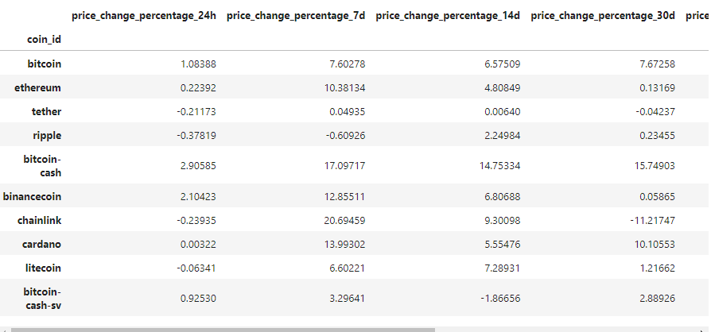
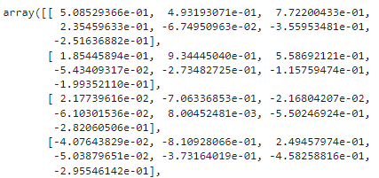
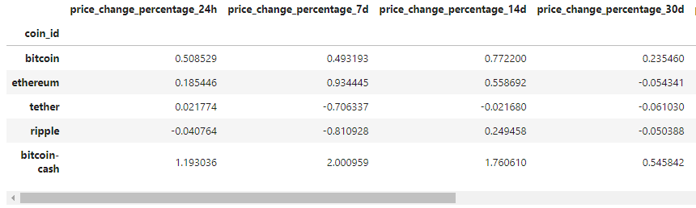
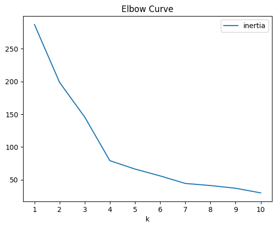
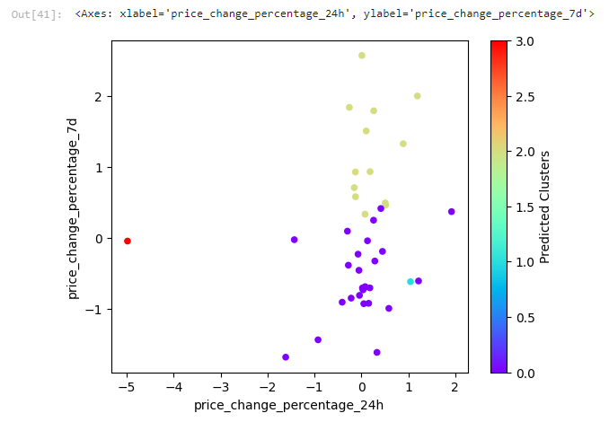
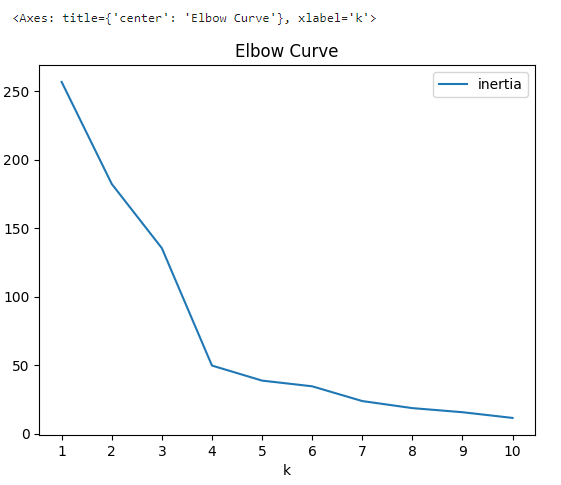

# $${\color{blue}Crypto \ Clustering}$$
Cluster Cryptocurrencies with K-Means, Finding Elbow Curve, and Optimize Clusters with Principal Component Analysis.

### In Step 1, we imported the necessary libraries and loaded data with "coin_id" as the  index column.
- The sci-kit-learn (sklearn) library was used to conduct the KMeans clusters, Principle Component Analysis, and StandardScaler to fit and transform the data.
```
# Import required libraries and dependencies

import pandas as pd
from sklearn.cluster import KMeans
from sklearn.decomposition import PCA
from sklearn.preprocessing import StandardScaler
import matplotlib.pyplot as plt

```


### Step 2 is to Prepare the Data by conducting preprocessing.
- We need to use **`StandardScaler()` module from sci-kit-learn to normalize the data from the  'market_data_df' DataFrame**.
- This step includes using `StandardScaler()` and then fit transforming the data.
- `StandardScaler()` = is used to standardize the features in the DataFrame by removing the mean and scaling to unit variance (z-score normalization).
- The **fit_transform() method computes the necessary statistics (mean and standard deviation) on market_data_df** and
- Then apply the transformation to the data. The result is a NumPy array where each feature has been scaled. 

#### DataFrame after preprocessing:


#### The next step during the preprocessing is to verify the data:
Verify that the mean of each feature (column) is 0: (ADD IMAGES)

Verify that the std of each feature (column) is 1: (ADD IMAGES)


### In Step 3, we will create a DataFrame with the scaled data, setting the Coin_id Column as the Index.
  #### DateFrame of scaled data:


## $${\color{blue}K-Means \space Clustering}$$ 

### Step 4 is to initialize the list to store 'k' and loop to Fit K-Means and Compute Inertia:
- This step aims to **initiate the empty list  inertia = []** to store the different values of 'k'.
- Inertia will store the sum of the squared distances of samples at their closest cluster center. This is used to evaluate clustering quality).
- k is a range of cluster counts to test (from 1 to 10).
```
# Create a list to store inertia values
inertia = []

# Create a list to store the values of k
k = list(range(1, 11))

for i in k:
    k_model = KMeans(n_clusters=i, random_state=2)
    k_model.fit(scaled_marketdata_df)
    inertia.append(k_model.inertia_)

```
### In Step 5 we need to Find the Best Value for k Using the Original Scaled DataFrame.
- During this step, we take the "inertia" list we lopped through in the previous step and create a DataFrame called **elbow_data**. 
- During this step, you also want to visualize the elbow curve.
#### K-Means Elbow Curve

  
- This plots the number of clusters (k) on the x-axis against the inertia on the y-axis.
- The "Elbow Curve" helps to identify the optimal number of clusters by looking for the "elbow" point where inertia starts to decrease more slowly.
- This point often suggests a good balance between model complexity and fit quality.
**Question:** What is the best value for k? 4

  ------------------------------------------------------------------------------------------------------------------------------------------------------
## $${\color{blue}K-Means \space Clustering \space on \space Scaled \space Data}$$ 

### Step 6 Applies K-means clustering to the scaled data to group cryptocurrencies into clusters.
- During this step, we use the optimal number from the previous analysis (Step 5) and initialize the K-Means model with 4 clusters and a fixed random seed for reproducibility.
```
model = KMeans(n_clusters=4, random_state=1)
model.fit(scaled_marketdata_df)
```
- We then fit the K-Means model to the scaled market data.
  
- Lastly, we assign cluster labels to each data point based on the fitted model.
```
k_lower = model.predict(scaled_marketdata_df)'
```
- k_lower now includes the cluster predictions which we will use in the next step. 

## Adding Cluster Predictions to DF and Visualizing the Clusters on a scatter plot. 

### Step 7 includes adding the cluster predictions into a  DataFrame to create a scatter plot to visualize it.
- Here we will be creating a copy of the scaled_marketdata_df and adding a new column with the k_lower from Step 6
```
scaled_marketdata_prediction['Predicted Clusters'] = k_lower'
```
#### Scatter Plot for K-Means Clusters

- **In this scatter plot we set `x="price_change_percentage_24h"` and `y="price_change_percentage_7d"`.**

## $${\color{blue}Principal \space Component \space Analysis \space (PCA)}$$ 

### Step 8 is to create a DataFrame with PCA Components similar to other previous analyses.
- During this step, we will create a PCA model and set the number of principal components to 3.
- - The fit transform performs PCA on the scaled data, transforming it into a three-dimensional space.

```
PCA = PCA(n_components=3)
PCA_market_scaled = PCA.fit_transform(scaled_marketdata_df)
```
### Step 9 includes Plotting Elbow Curve
- The elbow curve is the same as the K-Means analysis.
    
#### PCA Elbow Curve 


### Step 10 includes conducting similar steps as the K-Means and Creating a scatter plot 
- Initializing the K-Means models, fitting, predicting clusters, and adding the predicted clusters to a DF with a new column.
```
# Initialize the K-Means model using the best value for k
k = KMeans(n_clusters=4, random_state=1)

# Fit the K-Means model using the PCA data
k.fit(pca_df_marketdata)

# Predict the clusters to group the cryptocurrencies using the PCA data
k_model = k.predict(pca_df_marketdata)

# Create a copy of the DataFrame with the PCA data
k_model_copy = pca_df_marketdata.copy()
#---

# Add a new column to the DataFrame with the predicted clusters
k_model_copy['Predict Cluster'] = k_model

#---

# Create a scatter plot using hvPlot by setting `x="PCA1"` and `y="PCA2"`. 
k_model_copy.plot.scatter(
    x="PCA1",
    y="PCA2",
    c=k_model,
    colormap='rainbow')
```
#### Scatter plot visualizing PCA Clusters


### In Step 11, we transpose the features to retrieve the weights of the principal components.
- During this step, we will create a DataFrame called components_weights_pca that transposes the features.
- Each column represents the weight of that feature in each principal component. (ADD IMAGE OF TRANSPOSE)
```
components_weights_pca = pd.DataFrame(PCA.components_.T,columns=['PCA1', 'PCA2', 'PCA3'], 
                                      index=scaled_marketdata_df.columns)'
components_weights_pca
```
## $${\color{blue}Interpretation \space of \space the \space Results.}$$ 
- For PCA1, price_change_percentage_200d (0.594468) and price_change_percentage_1y (0.568379) have the strongest positive influence, while price_change_percentage_24h (-0.416728) has the strongest negative influence.

- For PCA2, price_change_percentage_30d (0.562182) and price_change_percentage_14d (0.540415)have the strongest positive influence, while price_change_percentage_1y (-0.150789) has the strongest negative influence.

- For PCA3, price_change_percentage_7d (0.787670) and price_change_percentage_14d (0.349534) have the strongest positive influence, while price_change_percentage_60d (-0.361377) has the strongest negative influence.


